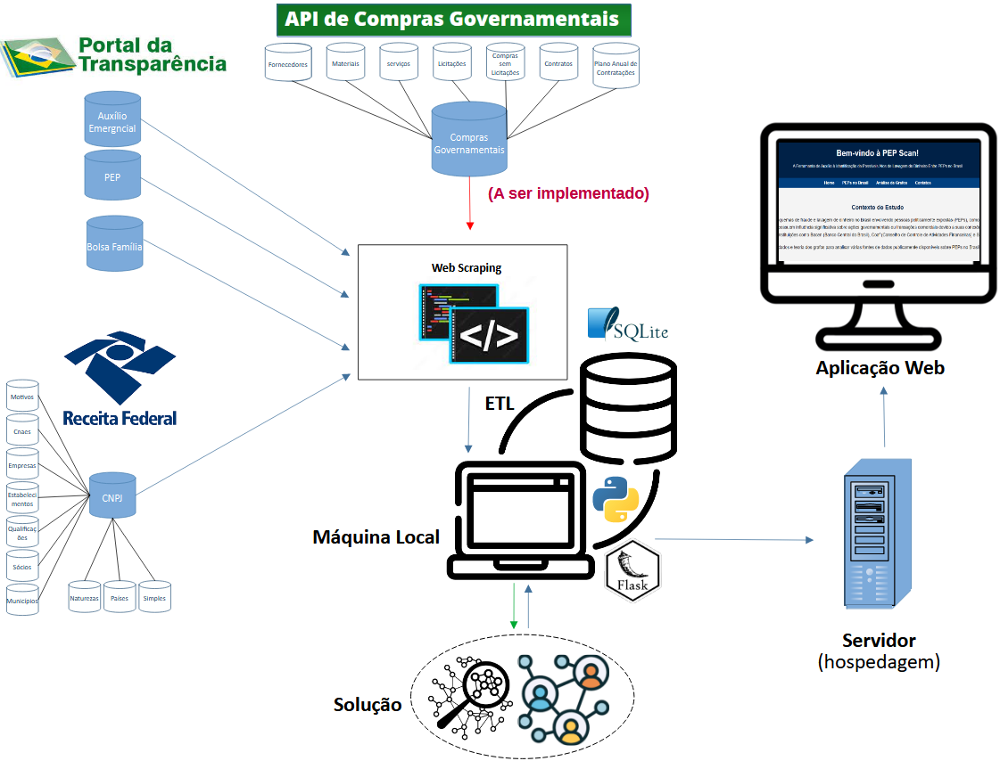

# PEP Scan - Ferramenta para identificar possíveis benefícios indevidos recebidos por autoridades públicas

<p align="center">
  
</p>

## Visão Geral do Projeto

O **PEP Scan** é um sistema web desenvolvido em **Python** com o framework **Flask**, dedicado à análise de relacionamentos entre Pessoas Politicamente Expostas (**PEPs**) e beneficiários de programas sociais governamentais, como Auxílio Emergencial e Bolsa Família. O principal objetivo é fornecer uma ferramenta de inteligência de dados para identificar potenciais conflitos de interesse ou irregularidades.

A aplicação utiliza uma abordagem de **Grafos** para modelar as conexões entre diferentes entidades (pessoas, empresas e programas de auxílio). Isso permite a visualização de redes complexas e a descoberta de caminhos ocultos, tornando a análise de dados mais intuitiva e poderosa.

---

## Funcionalidades Chave

A aplicação é dividida em várias páginas, cada uma com um propósito específico, acessíveis através de uma barra de navegação responsiva:

* **Página Principal (Home)**: Uma introdução à ferramenta, explicando o conceito de PEPs e as principais funcionalidades oferecidas. Inclui um guia de uso rápido de 5 passos para orientar o usuário.
* **Distribuição de PEPs**: Exibe análises descritivas sobre a distribuição de PEPs (Políticos e Não-Políticos) por estado e categoria, utilizando gráficos e mapas para visualização.
* **Auxílios do Governo**: Detalha os programas de auxílio social (Bolsa Família e Auxílio Emergencial) e apresenta a lista de PEPs que se beneficiaram desses programas. Os dados são paginados e podem ser baixados em formato CSV.
* **Análise de Relacionamentos**: A interface principal para a busca e exploração de redes de relacionamento. O usuário pode inserir o nome e o documento (CPF ou CNPJ) de uma entidade para visualizar suas conexões diretas em um grafo interativo. É possível expandir a análise clicando nos nós do grafo.
* **Caminho Mais Curto**: Permite encontrar o caminho mais curto entre duas entidades na rede de relacionamentos. O resultado é exibido em um formato textual e visual.
* **Perguntas Frequentes (FAQ)**: Respostas para as dúvidas mais comuns sobre o projeto, seus dados e a metodologia utilizada.
* **Contato**: Informações de contato do time de desenvolvimento, incluindo e-mails e endereço institucional no ICMC-USP.

---

## Estrutura do Projeto

A arquitetura da aplicação segue o padrão Flask, com a organização dos arquivos e pastas conforme a convenção.

```
MECAI/
│-- project/
│-- static/images/          # Imagens utilizadas na aplicação
│   ├── arquitetura.png
│   ├── diag_arq.png
│   ├── distribution_pep_aux_emer.png
│   ├── peps_distribution.png
│   ├── user.png
│
│-- templates/              # Páginas HTML (Flask Jinja2)
│   ├── contacts.html
│   ├── descriptive_analysis.html
│   ├── faq.html
│   ├── index.html
│   ├── peps_distribution.html
│   ├── shortest_path.html
│   ├── user_input_analysis.html
│
│-- venv/                   # Ambiente virtual (não versionado)
│-- .gitignore
│-- app.py                  # Aplicação principal Flask
│-- mecai.db                # Banco de dados SQLite
│-- graph_mecai_8.pkl       # Grafo em Pickle
│-- requirements.txt        # Dependências do projeto
```

* `app.py`: O arquivo principal da aplicação Flask, onde estão definidas as rotas e a lógica de negócio.
* `project/templates/`: Contém todos os arquivos HTML que compõem as páginas da aplicação.
* `project/static/images/`: Armazena as imagens estáticas utilizadas nos templates, como gráficos gerados e ícones.
* `mecai.db`: Banco de dados SQLite utilizado para armazenar os dados consolidados das fontes públicas. (muito pesado para ser disponibilizado no GitHub). O Arquivo graph_mecai_8.pkl foi regado a partir desse banco de dados, para ser utilizado nessa PoC.
* `requirements.txt`: Lista de dependências do projeto Python.

---

## Tecnologias Utilizadas

A stack tecnológica do projeto é robusta e moderna, focada em desenvolvimento de aplicações web e análise de dados.

* **Backend**: Python, Flask, SQLite
* **Frontend**: HTML, CSS, JavaScript (jQuery)
* **Visualização de Dados**: Vis.js (para visualização de grafos)
* **Gerenciamento de Código**: Git e GitHub

---
## Endereço da Ferramenta
Link PEP Scan: http://44.203.124.107:5000/ (apenas para a PoC)

## Como Rodar o Projeto em sua Máquina Local

Para configurar e executar o projeto localmente, siga os passos abaixo:

1.  **Clone o repositório:**
    ```bash
    git clone [https://github.com/s64864316/PEP_Scan.git]
    cd MECAI
    ```

2.  **Crie e ative o ambiente virtual:**
    ```bash
    python -m venv venv
    # No Windows
    venv\Scripts\activate
    # No macOS/Linux
    source venv/bin/activate
    ```

3.  **Instale as dependências:**
    ```bash
    pip install -r requirements.txt
    ```

4.  **Execute a aplicação:**
    ```bash
    python app.py
    ```
    A aplicação estará disponível em `http://127.0.0.1:5000`.

---

## Fontes de Dados

A base de dados da aplicação é construída a partir da integração de diversas fontes públicas e oficiais, garantindo transparência e rastreabilidade:

* **Base de PEPs**: Dados de Março de 2023 (Portal da Transparência)
* **Base de CNPJ**: Dados de Março de 2023 (dados.gov.br)
* **Base de Auxílio Emergencial**: Dados de Abril/2022 a Fevereiro/2023 (dados.gov.br)
* **Base de Bolsa Família**: Dados de Janeiro/2023 a Novembro/2021 (gov.br/mds)

---

## Contribuição

Contribuições são sempre bem-vindas! Se você tiver ideias, sugestões, ou encontrar algum problema, sinta-se à vontade para abrir uma *issue* ou enviar um *pull request*.
